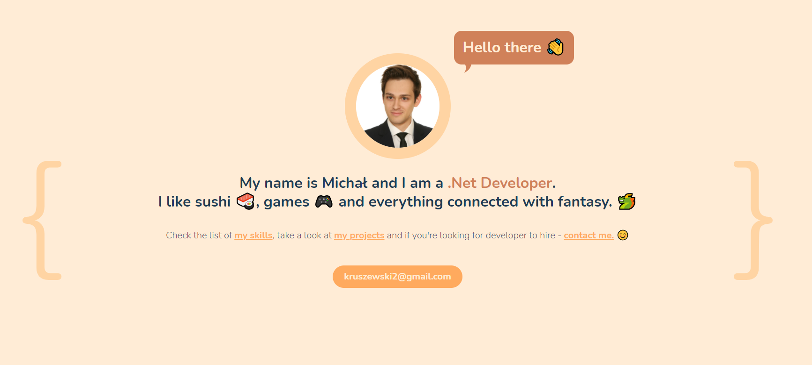
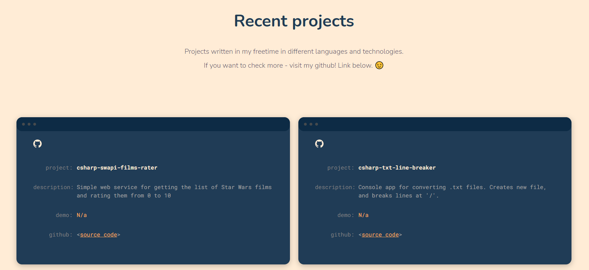
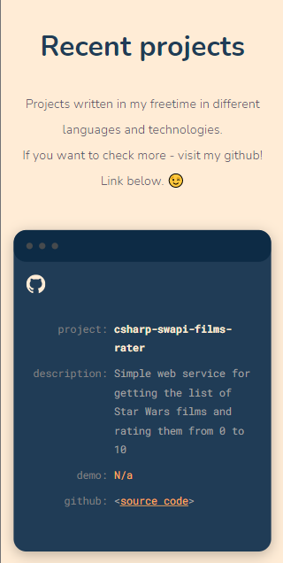

# Online CV
"Online CV" is a simple webpage created during [WTF: Co ten frontend](https://cotenfrontend.pl/) course.  
It contains my skills, and listed my github repositories.  
Check it on your own! 😉

## Summary
Online CV is a simple webpage written in HTML with usage of sass and vanillaJS.  
Page is responsive - written for both - pc and mobile and was created to:
- show my basic-frontend skills (vanilla)  
- present my work with lists of my skills and github projects / repositories.  

Every listed repository has small description and direct link to github repo (*github*), what is more some repos have additional link (*demo*) to ghpages where you can check my work without downloading or copying my code.

## Screenshots
Example screenshots listed below.

1. 
2. 
3. 
4. 
